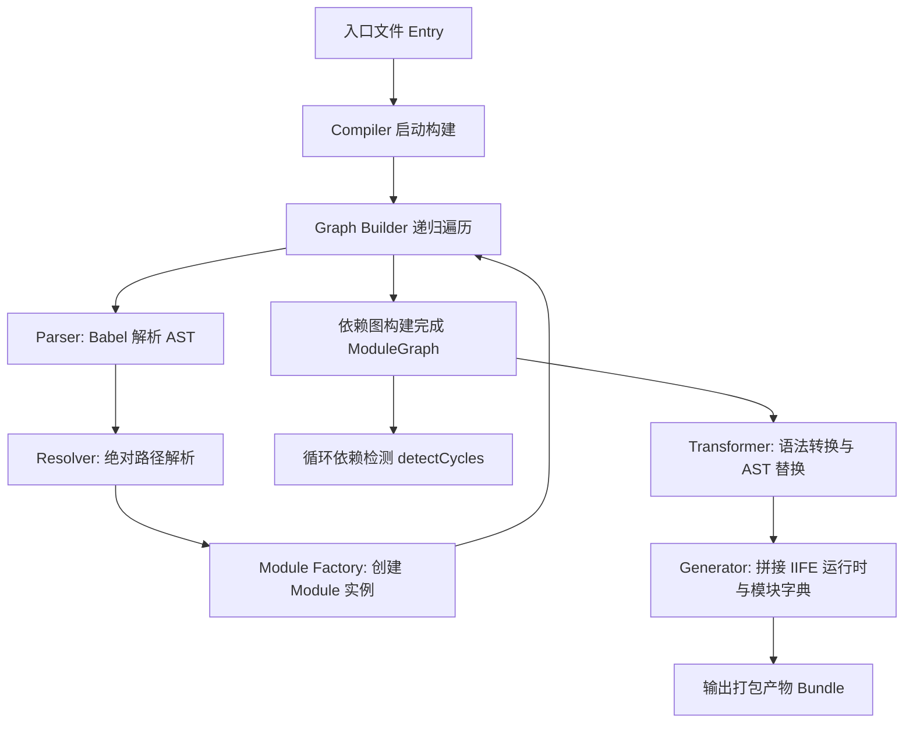

# mini-webpack

> 💡 一个基于 TypeScript 与 Monorepo 架构实现的轻量级 JavaScript 打包器（Bundler）核心实现。

`mini-webpack` 旨在深入剖析现代前端打包工具（如 Webpack）的核心机制，通过将打包流程解耦为独立的微包（Micro-packages），完整展示从**源码解析、路径寻址、依赖图构建、循环引用检测到代码转换与闭包生成**的完整生命周期。

---

## ✨ 核心特性

- 🧩 **清晰的 Monorepo 模块化分层**：将 AST 解析、路径解析、模块建模、依赖图构建、代码转换、代码生成、运行时及编译器等各阶段完全解耦。
- 🌳 **依赖图构建（Dependency Graph）**：基于队列（BFS 广度优先搜索）从入口文件递归解析所有子依赖。
- 🔄 **循环依赖检测（Cycle Detection）**：基于深度优先搜索（DFS）与回溯三色状态染色法，精准检测并捕获环路路径。
- ⚡ **AST 语义提取**：使用 `@babel/parser` 解析 ES Module 静态语法树并提取依赖元数据。
- 📦 **闭包字典与代码生成**：将各个模块包装为隔离的作用域函数字典 `{ [id]: function(module, exports) { ... } }`。

---

## 🏛 架构与模块划分

项目使用 [pnpm workspace](https://pnpm.io/workspaces) 进行多包管理：

```
mini_webpack/
├── packages/
│   ├── types/         # AST 结构与核心类型定义
│   ├── parser/        # 基于 @babel/parser 的源码解析器
│   ├── resolver/      # 模块绝对路径解析器
│   ├── module/        # 模块实体工厂（Module & Dependency 分析）
│   ├── graph/         # 依赖图构建与循环依赖分析
│   ├── transformer/   # 模块代码转换（AST 替换/重写）
│   ├── generator/     # Bundle 代码生成与模块包装
│   ├── runtime/       # 浏览器/Node 端的运行时加载器（__webpack_require__）
│   └── compiler/      # 打包器主调度引擎（Pipeline 串联）
└── examples/
    └── basic/         # 基础依赖与循环依赖测试案例
```

### 模块职责一览

| Package | 职责说明 | 状态 |
| :--- | :--- | :--- |
| **`@mini-webpack/types`** | 统一维护核心 AST 接口（`Program`, `ImportDeclaration`, `ImportSpecifier`） | 稳定 |
| **`@mini-webpack/parser`** | 调用 Babel 解析 ECMAScript 模块源码并过滤提取导入声明 | 迭代中 |
| **`@mini-webpack/resolver`** | 将相对路径解析为磁盘上的物理绝对路径 | 迭代中 |
| **`@mini-webpack/module`** | 实例化 `Module` 对象，分配全局唯一 `id` 并关联依赖清单 | 稳定 |
| **`@mini-webpack/graph`** | 遍历构建 `ModuleGraph`，提供 `detectCycles` 循环依赖检测 | 稳定 |
| **`@mini-webpack/transformer`** | 将 ESM 导入/导出转为运行时 `require` / `module.exports` 形式 | 开发中 |
| **`@mini-webpack/generator`** | 生成可执行的模块字典代码片段 | 迭代中 |
| **`@mini-webpack/runtime`** | 打包产物中的 IIFE 引导代码与模块缓存管理 | 规划中 |
| **`@mini-webpack/compiler`** | 统一入口，统筹串联所有构建阶段输出最终 Bundle | 规划中 |

---

## 🔄 构建核心流程



---

## 🚀 快速上手

### 环境准备

- Node.js >= 18
- pnpm >= 10.x

### 安装与构建

```bash
# 1. 安装依赖
pnpm install

# 2. 全量构建所有子包
pnpm build
```

### 调试与执行

可以直接使用 `tsx` 快速执行并调试各个子包的逻辑：

```bash
# 调试依赖图构建与循环依赖检测
npx tsx packages/graph/src/index.ts

# 调试代码生成
npx tsx packages/generator/src/index.ts
```

---

## 🗺 开发路线（Roadmap）

- [x] 模块依赖图构建与 BFS 遍历
- [x] 基于 DFS 的循环依赖检测算法
- [x] 模块包装器与代码生成字典骨架
- [ ] 扩展 Parser 支持 `ImportDefaultSpecifier` 及 `Export` 语法
- [ ] 基于 Babel Traverse 实现完整的 AST 代码转换（ESM -> CJS 闭包）
- [ ] 实现 `runtime` 模块加载模板（`__webpack_require__` 与缓存）
- [ ] 实现 `compiler` 打包引擎统一接入 CLI / 配置文件
- [ ] 支持 Loader / Plugin 机制（生命周期 Hooks）
